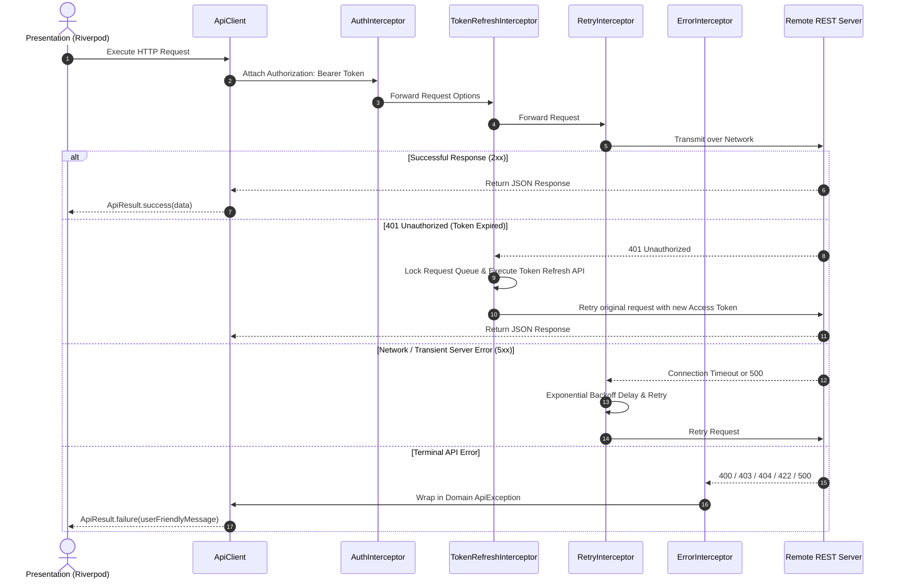

# 🚀 Flutter REST API Example (`flutter-rest-api`)

[](https://flutter.dev)
[](https://dart.dev)
[](https://m3.material.io)
[](https://blog.cleancoder.com/uncle-bob/2012/08/13/the-clean-architecture.html)
[](https://riverpod.dev)
[](https://pub.dev/packages/dio)
[](LICENSE)

A production-ready, highly scalable Flutter REST API reference project demonstrating senior engineering patterns: **Clean Architecture**, **SOLID Principles**, **Riverpod State Management**, and **Dio Networking** with **Material 3 Design**.

---

## 📌 Project Overview

This repository demonstrates how to architect a real-world enterprise Flutter application with robust networking capabilities:
- **Clean Architecture & Feature-First Directory Structure**
- **Generic `ApiClient` Wrapper** for `GET`, `POST`, `PUT`, `PATCH`, `DELETE`, `Multipart Upload`, and `File Download`
- **Dio Interceptors Stack**: Logging, Authorization, Token Refresh with Request Locking, Retry with Exponential Backoff, and Domain Error Interceptors
- **JWT Token Lifecycle Management**: Access token injection, auto-refresh on 401 Unauthorized, queueing concurrent requests, and secure local storage
- **Domain Exception Mapping**: Converts network outages, timeouts, and status codes (400, 401, 403, 404, 409, 422, 500) into user-friendly UI error notifications
- **In-Memory Caching**: TTL expiration strategy preventing unnecessary remote HTTP requests
- **Pagination Patterns**: Infinite scrolling, Pull-to-Refresh, Load-More, and dual support for Page-Based and Cursor-Based pagination strategies
- **Material 3 UI**: Shimmer loading skeletons, empty states, error retry widgets, and dynamic Light/Dark mode toggling

---

## 🏗 Architecture & Flow Diagrams

### High-Level Clean Architecture Layers

```
                               ┌─────────────────────────────┐
                               │     Presentation Layer      │
                               │  (Widgets, Screens, UI)    │
                               └──────────────┬──────────────┘
                                              │
                                              ▼
                               ┌─────────────────────────────┐
                               │   State Management Layer    │
                               │   (Riverpod StateNotifiers) │
                               └──────────────┬──────────────┘
                                              │
                                              ▼
                               ┌─────────────────────────────┐
                               │      Domain & Repository    │
                               │   (Interfaces, Entities)    │
                               └──────────────┬──────────────┘
                                              │
                                              ▼
                               ┌─────────────────────────────┐
                               │    Data & Network Layer     │
                               │ (Dio, ApiClient, Storage)   │
                               └─────────────────────────────┘
```

### Network Interceptor Pipeline



---

## 📁 Directory Structure

```
lib/
├── main.dart                       # App entry point, Flutter binding & ProviderScope
├── app.dart                        # Main shell, Material 3 Theme, Navigation shell
├── core/                           # Cross-cutting core architecture modules
│   ├── config/
│   │   ├── env_config.dart         # Multi-environment config (Dev, Staging, Prod)
│   │   ├── app_constants.dart      # Storage keys, Endpoints, Headers, Pagination defaults
│   │   └── theme_config.dart       # Material 3 light & dark theme setup
│   ├── network/
│   │   ├── api_client.dart         # Generic Dio HTTP API client wrapper
│   │   ├── api_response.dart       # ApiResponse<T>, PaginatedResponse<T>, ApiResult<T>
│   │   ├── api_exception.dart      # ApiException hierarchy & error message converters
│   │   ├── cache_manager.dart      # In-memory TTL response cache manager
│   │   └── interceptors/
│   │       ├── logging_interceptor.dart        # Formatted console logging
│   │       ├── auth_interceptor.dart           # Dynamic Bearer header injection
│   │       ├── token_refresh_interceptor.dart  # Thread-safe 401 token refresh handler
│   │       ├── error_interceptor.dart          # Dio to Domain ApiException converter
│   │       └── retry_interceptor.dart          # Exponential backoff retry handler
│   ├── services/
│   │   ├── storage_service.dart     # Secure token & user session storage
│   │   ├── connectivity_service.dart# Real-time network status detector
│   │   └── download_service.dart    # Device downloads path generator
│   ├── models/
│   │   ├── user_model.dart          # User entity DTO & JSON converters
│   │   ├── auth_model.dart          # Auth tokens & Login payload models
│   │   └── pagination_model.dart    # Page & Cursor pagination parameters
│   ├── repositories/
│   │   ├── auth_repository.dart     # Abstract interface & impl for Authentication
│   │   ├── user_repository.dart     # Abstract interface & impl for User CRUD
│   │   └── file_repository.dart     # Abstract interface & impl for Upload/Download
│   └── providers/
│       └── core_providers.dart      # Riverpod dependency injection registry
├── features/                        # Feature-first modular components
│   ├── auth/                        # Authentication feature
│   │   ├── presentation/login_screen.dart
│   │   └── providers/auth_provider.dart
│   ├── users/                       # User management & directory
│   │   ├── presentation/
│   │   │   ├── user_list_screen.dart
│   │   │   ├── user_detail_screen.dart
│   │   │   └── user_form_dialog.dart
│   │   └── providers/user_provider.dart
│   ├── media/                       # File Upload & Download showcase
│   │   ├── presentation/
│   │   │   ├── upload_demo_screen.dart
│   │   │   └── download_demo_screen.dart
│   │   └── providers/file_provider.dart
│   ├── pagination/                  # Pagination strategy showcase
│   │   └── presentation/pagination_demo_screen.dart
│   └── theme/
│       └── providers/theme_provider.dart
└── shared/                          # Reusable UI widgets & state views
    └── widgets/
        ├── skeleton_loader.dart     # Shimmer skeleton loaders
        ├── empty_view.dart          # Clean empty state widget
        ├── error_view.dart          # Error retry view widget
        ├── custom_button.dart       # Primary & Outlined action button with loading spinner
        └── custom_text_field.dart   # Styled M3 text field with validation
```

---

## 🛠 Packages & Dependencies

| Package | Purpose |
|:---|:---|
| [`flutter_riverpod`](https://pub.dev/packages/flutter_riverpod) | Reactive state management & dependency injection |
| [`dio`](https://pub.dev/packages/dio) | Powerful HTTP client with Interceptors, Form-data, and CancelTokens |
| [`flutter_secure_storage`](https://pub.dev/packages/flutter_secure_storage) | Encrypted storage for access & refresh JWT tokens |
| [`shared_preferences`](https://pub.dev/packages/shared_preferences) | Key-value local storage for app settings & theme preference |
| [`shimmer`](https://pub.dev/packages/shimmer) | Material 3 skeleton loading placeholders |
| [`connectivity_plus`](https://pub.dev/packages/connectivity_plus) | Real-time network connectivity checking |
| [`path_provider`](https://pub.dev/packages/path_provider) | Cross-platform filesystem path resolution |
| [`mocktail`](https://pub.dev/packages/mocktail) | Type-safe mocking library for unit testing |

---

## ⚡ Getting Started

### Prerequisites
- Flutter SDK `^3.19.0` or later
- Dart SDK `^3.3.0` or later

### Installation

1. **Clone the repository**:
   ```bash
   git clone https://github.com/your-username/flutter-rest-api.git
   cd flutter-rest-api
   ```

2. **Install pub packages**:
   ```bash
   flutter pub get
   ```

3. **Run code analyzer**:
   ```bash
   flutter analyze
   ```

4. **Execute unit tests**:
   ```bash
   flutter test
   ```

5. **Launch Application**:
   ```bash
   flutter run
   ```

---

## 💡 Best Practices Implemented

1. **SOLID Principles**:
   - **Single Responsibility**: Each class has one focused duty (e.g. `AuthInterceptor` only injects headers, `UserListNotifier` only manages list state).
   - **Open/Closed**: Repository interfaces (`IUserRepository`, `IAuthRepository`) allow extending implementations without mutating clients.
   - **Liskov Substitution**: Storage implementations are fully interchangeable.
   - **Interface Segregation**: Clean, unbloated contracts for repositories.
   - **Dependency Inversion**: High-level modules depend on abstractions via Riverpod providers.

2. **Robust Network Resilience**:
   - Automatic retries with exponential backoff on transient network drops.
   - Seamless token refreshing without interrupting user interactions.
   - Graceful offline fallback messaging.

3. **Zero Secrets & Security**:
   - Tokens stored in encrypted OS keychain / key store.
   - Base URLs isolated inside `EnvConfig`.
   - Zero hardcoded passwords or API keys.

---

## 🛣 Future Improvements

- Add OAuth2 Authorization Code flow support.
- Implement GraphQL API client comparison module.
- Add integration test suite with `integration_test`.

---

## 📄 License

This project is licensed under the MIT License - see the [LICENSE](LICENSE) file for details.
